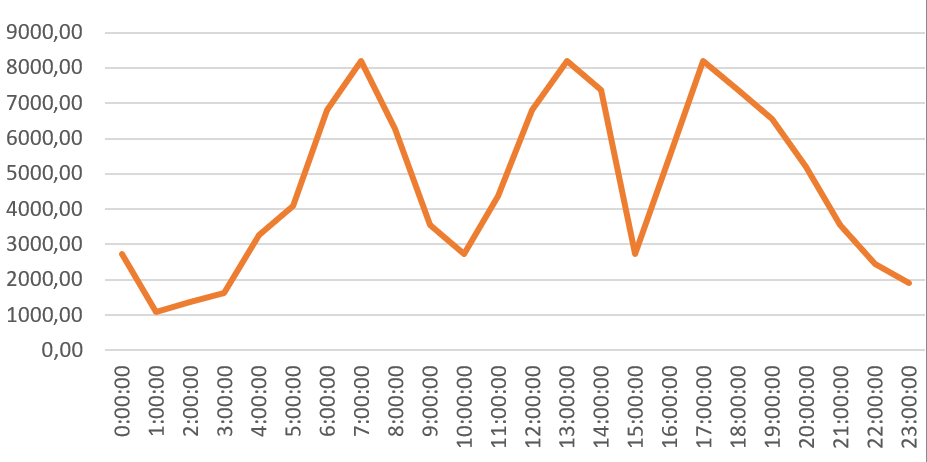
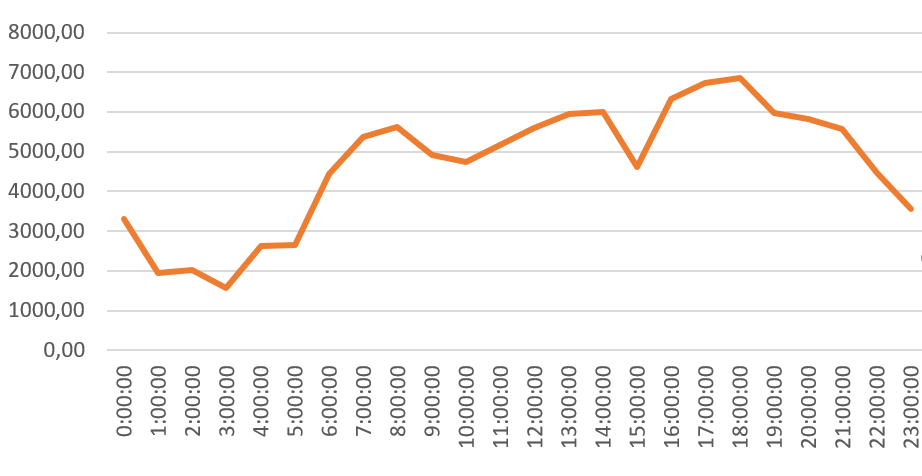

# Маршрутизатор

## Расчет нагрузки

- Яндекс.Карты web - 2 млн по 2 маршрута в день - 4 млн запросов/сутки 
- Яндекс.Карты mobile - 2.5 млн по 4 маршрута в день - 10 млн запросов/сутки
- Яндекс.Навигатор - 30 млн по 2 маршрута в день; 15 млн по 3 маршрута - 105 млн запросов/сутки

В пиковые моменты нагрузка с отдельных клиентов может возрастать:

- Множество людей куда-то выезжает, например в пятницу за город
  - Яндекс.Карты mobile +15%
  - Яндекс.Навигатор +30%
  - Итог: аудитория вырастет в 1.27 раза
- Происходит какое-то интересное событие, куда хочет попасть много людей:
  - Яндекс.Карты web +30%
  - Яндекс.Карты mobile +60%
  - Яндекс.Навигатор +50%
  - Итог: аудитория вырастет в 1.5 раза

Итог: 119 млн/сутки | сред ~ 2 727 rps | макс ~ сред * 1.5 * 3 = 12 272 rps

## Прогнозирование нагрузки

(нагрузка в обычный день, без коэфф 1.5)

## Дополнение условия

Если из аудитории Яндекс.Навигатора 40% живут в UTC+3, 30% UTC+5, 30% UTC+7

Тогда макс нагрузка ~ 6 857 rps

